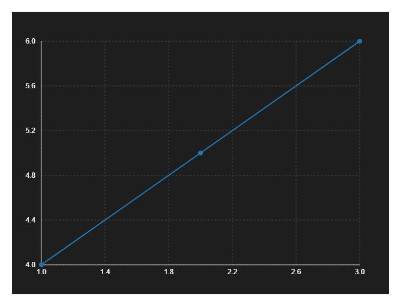
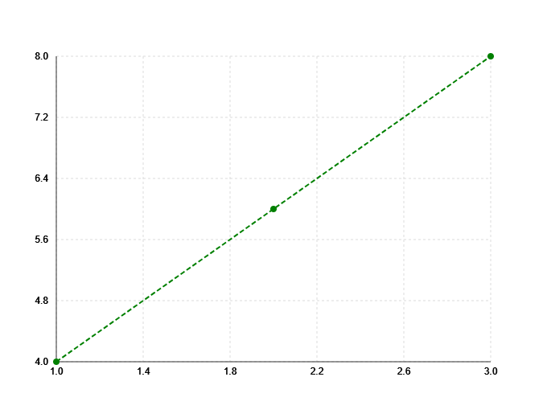
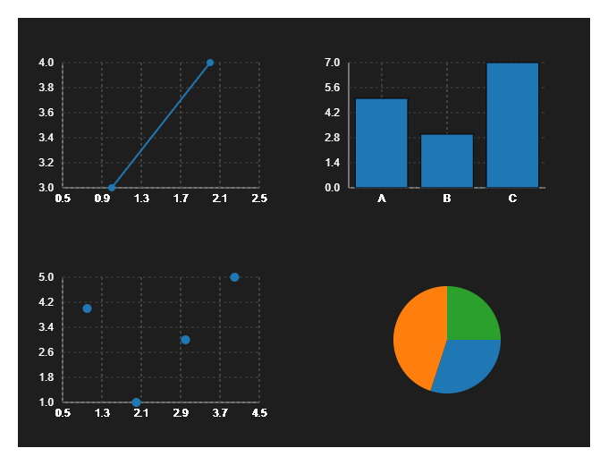

Customization
=============

Themes
------

You can set a global or per-chart theme:

.. code-block:: python

    from glyphx import plot, themes

    plot([1, 2, 3], [4, 5, 6], theme=themes["dark"])

Colors & Styles
---------------

Set custom colors, widths, and line styles:

.. code-block:: python

    from glyphx import plot

    plot([1, 2, 3], [4, 6, 8], color="green", linestyle="dashed")

Grid Layouts
------------

Use `Figure` and `add_axes()` to manually control multi-plot layouts:

.. code-block:: python

    from glyphx import Figure, series, themes

    fig = Figure(rows=2, cols=2, theme=themes["dark"])
    ax1 = fig.add_axes(0, 0)
    ax1.add(series.LineSeries([1, 2], [3, 4]))
    ax2 = fig.add_axes(1, 0)
    ax2.add(series.ScatterSeries(x=[1, 2, 3, 4], y=[4, 1, 3, 5]))
    ax3 = fig.add_axes(0,1)
    ax3.add(series.BarSeries(x=["A", "B", "C"], y=[5, 3, 7]))
    ax4 = fig.add_axes(1,1)
    ax4.add(series.PieSeries(values=[30, 45, 25], labels=["A", "B", "C"]))
    fig.plot()

