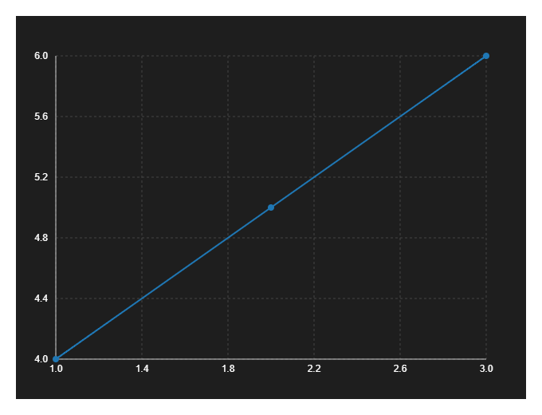
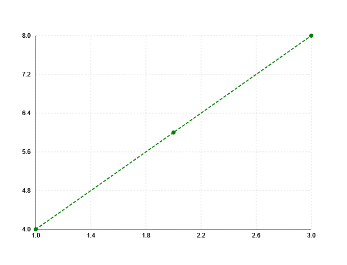
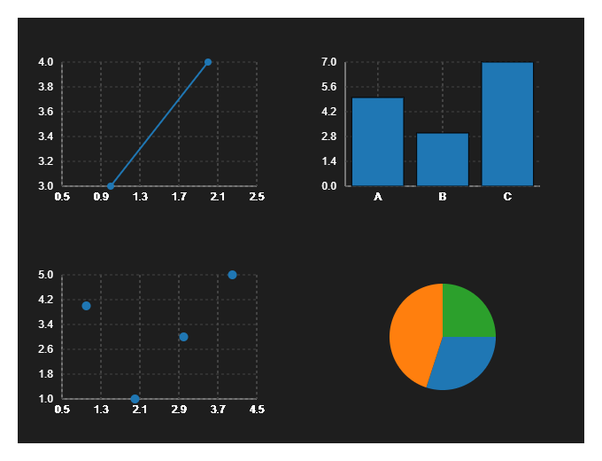

Customization
=============

Themes
------

GlyphX ships seven built-in themes. Pass the name as a string:

.. code-block:: python

   from glyphx import Figure

   Figure(theme="dark")
   Figure(theme="colorblind")   # Okabe-Ito palette — safe for all types
   Figure(theme="warm")
   Figure(theme="ocean")
   Figure(theme="pastel")
   Figure(theme="monochrome")
   Figure(theme="default")      # clean white (default)

Or apply mid-chain with ``.set_theme()``:

.. code-block:: python

   fig = Figure().set_theme("dark").add(...)

.. list-table:: Built-in Themes
   :widths: 20 40 40
   :header-rows: 1

   * - Name
     - Background
     - Color Palette
   * - ``default``
     - White
     - Tableau-style
   * - ``dark``
     - Charcoal (#1e1e1e)
     - Muted blues and ambers
   * - ``colorblind``
     - White
     - **Okabe-Ito** — safe for deuteranopia, protanopia, tritanopia
   * - ``pastel``
     - Off-white (#f9f9f9)
     - Soft muted tones
   * - ``warm``
     - Cream (#fff8f0)
     - Earthy reds and greens, Georgia serif font
   * - ``ocean``
     - Light blue (#f0f8ff)
     - Deep blues and teals
   * - ``monochrome``
     - White
     - Greys only — print-safe

.. note::
   The ``colorblind`` theme uses the `Okabe-Ito palette
   <https://jfly.uni-koeln.de/color/>`_, the scientific standard for
   colorblind-accessible data visualization. Earlier versions used grayscale
   incorrectly — this was fixed in v1.5.0.

Custom Themes
~~~~~~~~~~~~~

Pass a dict with any subset of theme keys:

.. code-block:: python

   my_theme = {
       "colors":      ["#ff6b6b", "#4ecdc4", "#45b7d1", "#96ceb4"],
       "background":  "#1a1a2e",
       "text_color":  "#eeeeee",
       "axis_color":  "#555",
       "grid_color":  "#333",
       "font":        "Roboto, sans-serif",
   }

   Figure(theme=my_theme)

Colors and Line Styles
----------------------

Pass ``color`` and ``linestyle`` directly to any series:

.. code-block:: python

   from glyphx.series import LineSeries

   LineSeries(x, y, color="#16a34a", linestyle="dashed", width=2)
   LineSeries(x, y, color="#dc2626", linestyle="dotted")
   LineSeries(x, y, color="#2563eb", linestyle="longdash")
   LineSeries(x, y, color="#7c3aed", linestyle="solid")   # default

Available ``linestyle`` values: ``"solid"``, ``"dashed"``, ``"dotted"``, ``"longdash"``

Colormaps
---------

Nine perceptually-uniform colormaps are built in, all designed to be accurate
when converted to grayscale:

.. list-table::
   :widths: 20 20 60
   :header-rows: 1

   * - Name
     - Type
     - Best for
   * - ``viridis``
     - Sequential
     - Default continuous encoding
   * - ``plasma``
     - Sequential
     - High-contrast continuous data
   * - ``inferno``
     - Sequential
     - Print-safe on dark backgrounds
   * - ``magma``
     - Sequential
     - Heatmaps and density plots
   * - ``cividis``
     - Sequential
     - Deuteranopia-safe alternative to viridis
   * - ``coolwarm``
     - Diverging
     - Correlation matrices, positive/negative
   * - ``rdbu``
     - Diverging
     - Two-sided data centered at zero
   * - ``spectral``
     - Multi-hue
     - Categorical ranges (use sparingly)
   * - ``greys``
     - Sequential
     - Monochrome / print output

.. code-block:: python

   from glyphx.colormaps import apply_colormap, colormap_colors, list_colormaps

   # Single value → hex color
   color = apply_colormap(0.75, "plasma")      # "#eb5f34"

   # N evenly-spaced colors (e.g. for a grouped bar chart)
   colors = colormap_colors("viridis", 6)

   # List all available names
   print(list_colormaps())

   # Color-encode scatter points by a third variable
   from glyphx.series import ScatterSeries
   ScatterSeries(x, y, c=z_values, cmap="inferno", size=7)

When ``c=`` is supplied, a colorbar strip with min/max labels is added to the
chart automatically.

Annotations
-----------

Add text callouts in data-space coordinates:

.. code-block:: python

   fig.annotate(
       "Record High",
       x=11, y=2.9,
       arrow=True,           # draw a leader line from text to point
       color="#dc2626",
       font_size=12,
       anchor="start",       # SVG text-anchor: start | middle | end
   )

Multiple annotations stack naturally — each is positioned independently.

Statistical Significance Brackets
----------------------------------

Annotate comparisons between groups with ``***`` / ``**`` / ``*`` / ``ns`` brackets:

.. code-block:: python

   fig = (
       Figure()
       .add(BarSeries(["Control","Drug A","Drug B"], means, yerr=errors))
       .add_stat_annotation("Control", "Drug A", p_value=0.0003)
       .add_stat_annotation("Control", "Drug B", p_value=0.031, y_offset=30)
   )

``y_offset`` shifts each bracket upward so multiple brackets don't overlap.
Use ``style="numeric"`` for exact p-value display instead of stars.

.. code-block:: python

   fig.add_stat_annotation("A", "B", p_value=0.0003, style="numeric")
   # → "p=3.00e-04" instead of "***"

Grid Layouts
------------

**Subplot grid on a single Figure:**

.. code-block:: python

   from glyphx import Figure
   from glyphx.series import LineSeries, BarSeries, ScatterSeries, PieSeries

   fig = Figure(rows=2, cols=2, width=1000, height=700)
   fig.add_axes(0, 0).add_series(LineSeries([1,2,3], [4,5,6]))
   fig.add_axes(0, 1).add_series(BarSeries(["A","B","C"], [5,3,7]))
   fig.add_axes(1, 0).add_series(ScatterSeries([1,2,3], [4,5,6]))
   fig.add_axes(1, 1).add_series(PieSeries([30,45,25], labels=["A","B","C"]))
   fig.show()

**Multiple independent Figures on one​​​​​​​​​​​​​​​​
