Examples
========

Basic Charts
------------

Line Chart — Multi-Series with Annotations
~~~~~~~~~~~~~~~~~~~~~~~~~~~~~~~~~~~~~~~~~~~

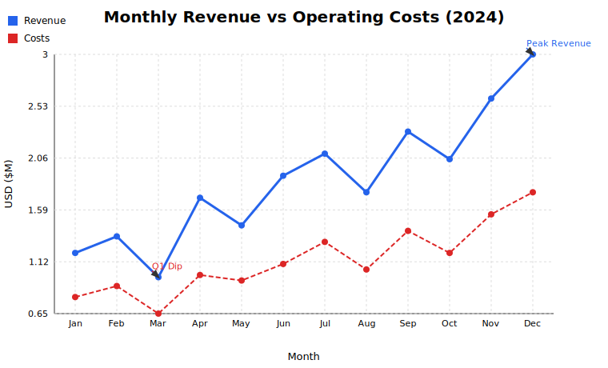

.. code-block:: python

   fig = (
       Figure(width=760, height=460)
       .set_title("Monthly Revenue vs Operating Costs  (2024)")
       .set_xlabel("Month").set_ylabel("USD ($M)")
       .add(LineSeries(months, revenue, color="#2563eb", label="Revenue", width=3))
       .add(LineSeries(months, costs,   color="#dc2626", label="Costs",   linestyle="dashed"))
       .set_legend("top-left")
       .annotate("Peak Revenue", x="Dec", y=3.00, arrow=True, color="#2563eb")
       .tight_layout()
   )
   fig.show()

Scatter with Colormap Encoding
~~~~~~~~~~~~~~~~~~~~~~~~~~~~~~~~

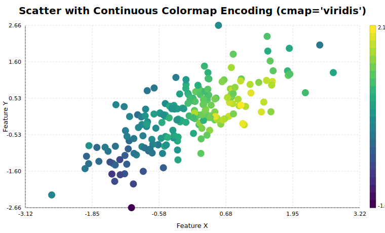

.. code-block:: python

   ScatterSeries(x, y, c=z_values, cmap="viridis", size=7)

Histogram — Bimodal Distribution
~~~~~~~~~~~~~~~~~~~~~~~~~~~~~~~~~~

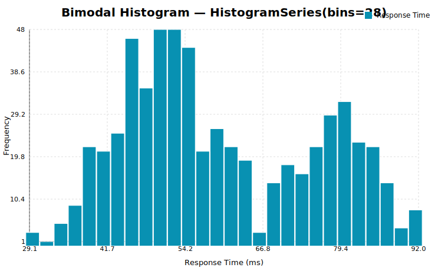

.. code-block:: python

   import numpy as np
   data = np.concatenate([np.random.normal(50,8,400), np.random.normal(78,6,200)])
   Figure().add(HistogramSeries(data.tolist(), bins=28, color="#0891b2")).show()

Pie and Donut Charts
~~~~~~~~~~~~~~~~~~~~~

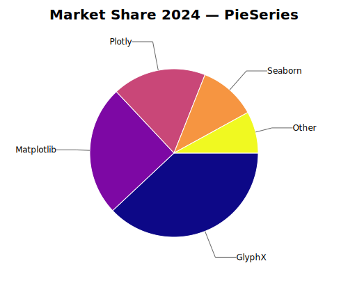

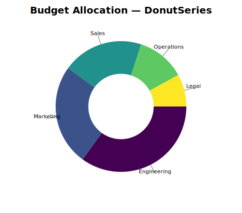

Heatmap — Correlation Matrix
~~~~~~~~~~~~~~~~~~~~~~~~~~~~~

.. image:: examples/heatmap.svg
   :alt: KPI correlation heatmap
   :width: 680px
   :align: center

Box Plot — Multi-Group
~~~~~~~~~~~~~~~~~~~~~~~

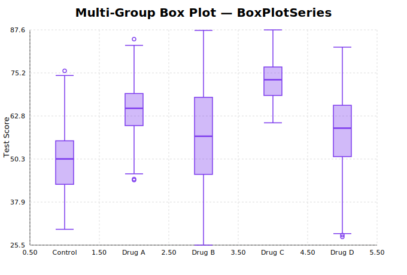

New 2-D Chart Types
-------------------

Bubble Chart
~~~~~~~~~~~~~

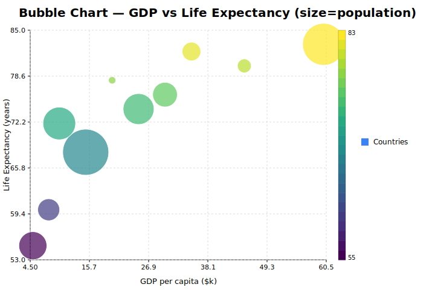

.. code-block:: python

   from glyphx.bubble import BubbleSeries

   fig = Figure().set_title("Market Cap vs Growth Rate")
   fig.add(BubbleSeries(x, y, sizes=market_cap, c=growth_rate,
                        cmap="plasma", label="Companies"))
   fig.show()

Sunburst Chart
~~~~~~~~~~~~~~~

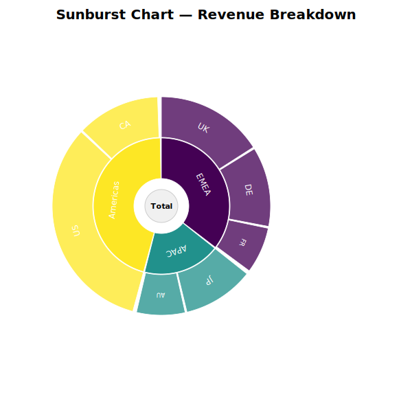

.. code-block:: python

   from glyphx.sunburst import SunburstSeries

   fig = Figure(width=600, height=600).set_title("Org Revenue Breakdown")
   fig.add(SunburstSeries(
       labels=["Total", "EMEA", "APAC", "Americas",
               "UK", "DE", "JP", "AU", "US", "CA"],
       parents=["",     "Total","Total","Total",
                "EMEA","EMEA","APAC","APAC","Americas","Americas"],
       values= [0,      0,      0,      0,
                420,    310,    280,    190,   850,       320],
   ))
   fig.show()

Parallel Coordinates
~~~~~~~~~~~~~~~~~~~~~

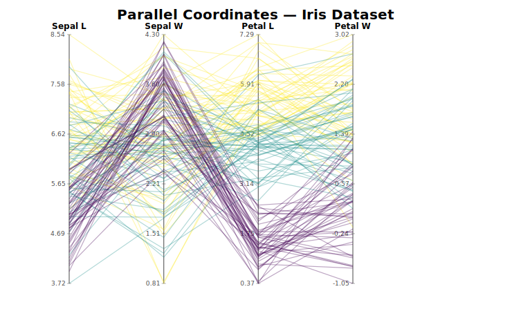

.. code-block:: python

   from glyphx.parallel_coords import ParallelCoordinatesSeries

   fig = Figure(width=900, height=500).set_title("Iris Dataset")
   fig.add(ParallelCoordinatesSeries(
       data=df[["sepal_length","sepal_width","petal_length","petal_width"]],
       labels=df["species"],
       cmap="viridis",
   ))
   fig.show()

Diverging Bar Chart
~~~~~~~~~~~~~~~~~~~~

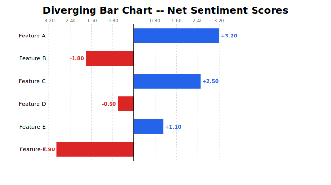

.. code-block:: python

   from glyphx.diverging_bar import DivergingBarSeries

   fig = Figure().set_title("YoY Growth by Region")
   fig.add(DivergingBarSeries(
       categories=["North","South","East","West","Central"],
       values=    [  12,    -8,     21,    -3,      15],
       color_pos="#2563eb",
       color_neg="#dc2626",
   ))
   fig.show()

3-D Charts
----------

``Figure3D`` renders via Three.js WebGL with full mouse, touch, and keyboard
controls.  Every chart also produces a static SVG fallback for environments
where JavaScript is unavailable.  Live interactive HTML outputs from these
examples are in ``docs/examples/11_3d_*.html``.

.. contents::
   :local:
   :depth: 1

3-D Scatter
~~~~~~~~~~~

Scatter points with continuous colour encoding on a fourth variable (``c=``).

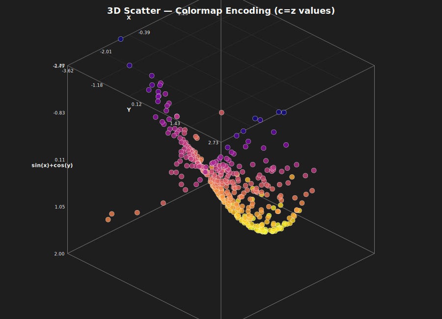

.. code-block:: python

   from glyphx import Figure3D
   from glyphx.scatter3d import Scatter3DSeries
   import numpy as np

   rng = np.random.default_rng(42)
   xs  = rng.normal(0, 1, 400)
   ys  = rng.normal(0, 1, 400)
   zs  = np.sin(xs) + np.cos(ys)

   fig = Figure3D(title="3D Scatter -- Colormap Encoding", theme="dark",
                  azimuth=45, elevation=25)
   fig.scatter(xs, ys, zs,
               c=zs,          # colour each point by its Z value
               cmap="plasma",
               size=5, alpha=0.80,
               label="sin(x)+cos(y)")
   fig.show()
   fig.save("scatter3d.html")  # self-contained interactive HTML

Multiple labelled series -- click the legend to toggle each one:

.. code-block:: python

   fig = Figure3D(title="3D Scatter -- Multiple Series")
   for label, color, dx in [("Group A", "#2563eb",  0),
                             ("Group B", "#dc2626",  2),
                             ("Group C", "#16a34a", -2)]:
       xs = np.random.randn(80) + dx
       fig.scatter(xs, np.random.randn(80), np.random.randn(80),
                   color=color, size=5, label=label)
   fig.show()

3-D Surface
~~~~~~~~~~~

Regular ``z = f(x, y)`` grids with optional wireframe overlay.  Large grids
are automatically decimated and sub-pixel faces culled before rendering.

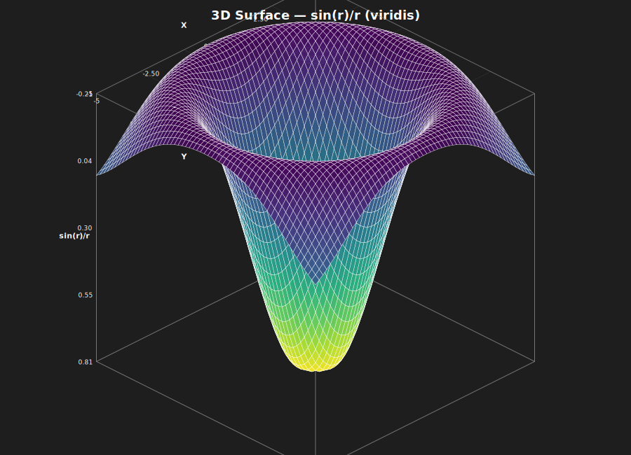

.. code-block:: python

   from glyphx import Figure3D
   from glyphx.surface3d import Surface3DSeries
   import numpy as np

   # sinc surface  z = sin(r) / r
   x = np.linspace(-5, 5, 60)
   y = np.linspace(-5, 5, 60)
   X, Y = np.meshgrid(x, y)
   Z = np.sin(np.sqrt(X**2 + Y**2)) / (np.sqrt(X**2 + Y**2) + 0.1)

   fig = Figure3D(title="sin(r)/r Surface", theme="dark")
   fig.surface(x, y, Z, cmap="viridis", alpha=0.92, wireframe=True)
   fig.show()

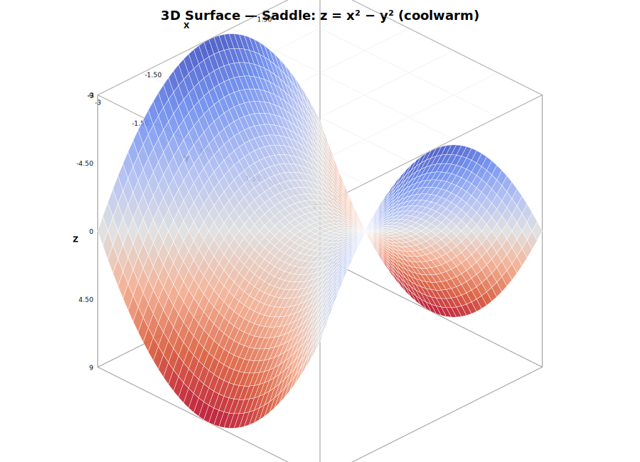

.. code-block:: python

   # Saddle  z = x^2 - y^2
   x = np.linspace(-3, 3, 45)
   y = np.linspace(-3, 3, 45)
   X, Y = np.meshgrid(x, y)
   Z = X**2 - Y**2

   fig = Figure3D(title="Saddle: z = x2 - y2")
   fig.surface(x, y, Z, cmap="coolwarm", alpha=0.88)
   fig.show()

3-D Line
~~~~~~~~

Parametric curves in 3-D space.  LTTB downsampling runs in camera-projected
screen coordinates, so visible detail adapts to the viewing angle.

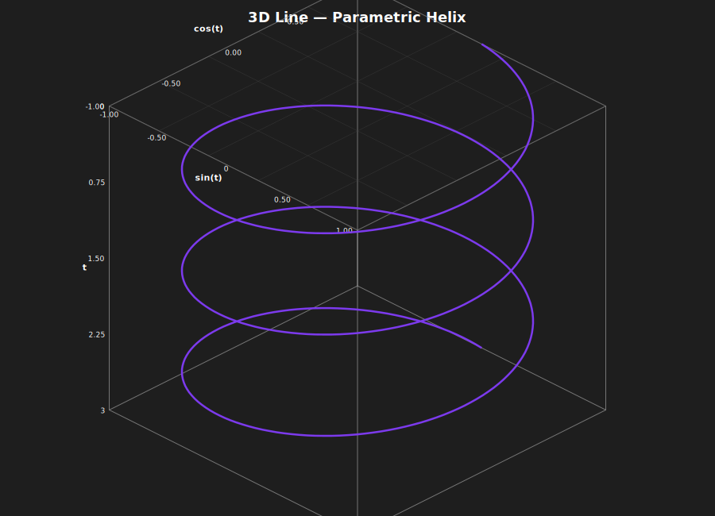

.. code-block:: python

   from glyphx import Figure3D
   from glyphx.line3d import Line3DSeries
   import numpy as np

   # Helix
   t = np.linspace(0, 6 * np.pi, 1_000)
   fig = Figure3D(title="Parametric Helix", theme="dark")
   fig.line3d(np.cos(t), np.sin(t), t / (2 * np.pi),
              color="#7c3aed", width=2.5, label="Helix")
   fig.show()

   # Lissajous curve (3:2:1)
   t = np.linspace(0, 2 * np.pi, 500)
   fig = Figure3D(title="Lissajous 3:2:1")
   fig.line3d(np.sin(3*t), np.sin(2*t), np.sin(t), color="#0891b2", width=2)
   fig.show()

3-D Bar Chart
~~~~~~~~~~~~~

Vertical bars on a 2-D ``(x, y)`` base grid, useful for cross-tabulations and
2-D frequency histograms.

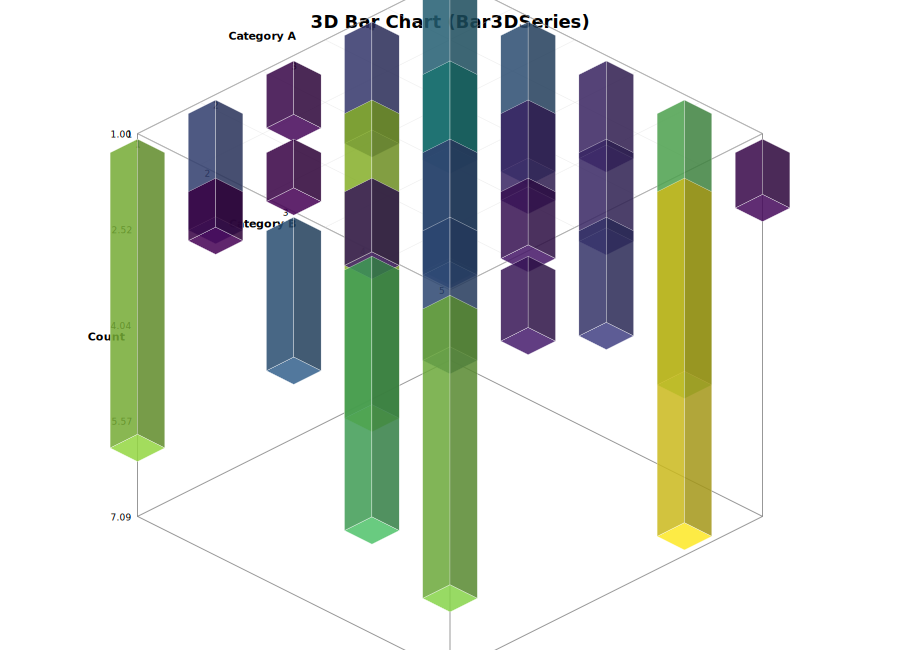

.. code-block:: python

   from glyphx import Figure3D
   from glyphx.bar3d import Bar3DSeries
   import numpy as np

   x_cats  = np.arange(1, 6)
   y_cats  = np.arange(1, 6)
   heights = np.abs(np.random.randn(5, 5)) * 3 + 1   # shape (n_y, n_x)

   fig = Figure3D(title="3D Bar Chart")
   fig.bar3d(x_cats, y_cats, heights, cmap="viridis")
   fig.show()

   # Monthly revenue by product line (4 products x 12 months)
   months   = list(range(1, 13))
   products = list(range(1, 5))
   revenue  = np.abs(np.random.randn(4, 12) * 0.5 + 2)

   fig = Figure3D(title="Monthly Revenue by Product", theme="dark")
   fig.set_xlabel("Month").set_ylabel("Product").set_zlabel("Revenue ($M)")
   fig.bar3d(months, products, revenue, cmap="plasma")
   fig.show()

Surface + Scatter Overlay
~~~~~~~~~~~~~~~~~~~~~~~~~

Overlay observed data points on a fitted surface -- a common pattern in
machine learning and scientific visualisation.

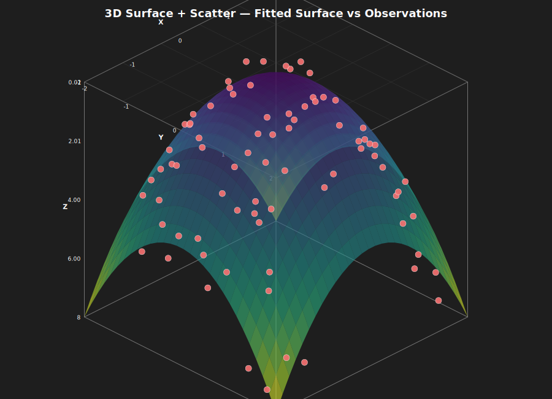

.. code-block:: python

   import numpy as np
   from glyphx import Figure3D

   # Fitted surface  z = x^2 + y^2
   x = np.linspace(-2, 2, 30)
   y = np.linspace(-2, 2, 30)
   X, Y = np.meshgrid(x, y)
   Z_fit = X**2 + Y**2

   # Noisy observations
   obs_x = np.random.uniform(-2, 2, 80)
   obs_y = np.random.uniform(-2, 2, 80)
   obs_z = obs_x**2 + obs_y**2 + np.random.randn(80) * 0.3

   fig = Figure3D(title="Fitted Surface vs Observations", theme="dark")
   fig.surface(x, y, Z_fit, cmap="viridis", alpha=0.60)
   fig.scatter(obs_x, obs_y, obs_z,
               color="#f87171", size=5, label="Observations")
   fig.show()

2-D Contour Plot
~~~~~~~~~~~~~~~~

``ContourSeries`` uses the marching-squares algorithm to draw filled contours
on a regular 2-D grid -- a 2-D companion to ``Surface3DSeries``.

.. code-block:: python

   from glyphx import Figure
   from glyphx.contour import ContourSeries
   import numpy as np

   x = np.linspace(-4, 4, 80)
   y = np.linspace(-4, 4, 80)
   X, Y = np.meshgrid(x, y)
   Z = np.exp(-(X**2 + Y**2) / 4) * np.cos(X) * np.cos(Y)

   fig = Figure(width=680, height=560)
   fig.set_title("2D Contour -- marching squares")
   fig.add(ContourSeries(x, y, Z, levels=14, cmap="coolwarm",
                         filled=True, lines=True))
   fig.show()

   # Rosenbrock function (banana valley)
   x = np.linspace(-2, 2, 60)
   y = np.linspace(-1, 3, 60)
   X, Y = np.meshgrid(x, y)
   Z = np.log1p((1 - X)**2 + 100*(Y - X**2)**2)

   fig = Figure(width=680, height=560)
   fig.set_title("Rosenbrock Function")
   fig.add(ContourSeries(x, y, Z, levels=16, cmap="inferno",
                         filled=True, lines=True))
   fig.show()

Themes
~~~~~~

The seven 2-D themes all work in 3-D.  ``dark`` is recommended for
presentations; ``ocean`` suits data-heavy dashboards.

.. code-block:: python

   for theme in ["default", "dark", "ocean", "warm", "colorblind"]:
       fig = Figure3D(title=f"Surface -- {theme}", theme=theme)
       fig.surface(x, y, Z, cmap="viridis", alpha=0.88)
       fig.save(f"surface_{theme}.html")

Large-Data Downsampling
~~~~~~~~~~~~~~~~~~~~~~~

GlyphX automatically downsamples every 3-D series before SVG generation.
Inspect what happened via ``last_downsample_info``:

.. code-block:: python

   import numpy as np
   from glyphx import Figure3D
   from glyphx.scatter3d import Scatter3DSeries
   from glyphx.surface3d import Surface3DSeries
   from glyphx.line3d    import Line3DSeries

   rng = np.random.default_rng(0)
   n   = 500_000

   # Scatter -- 3D voxel thinning
   s3 = Scatter3DSeries(rng.uniform(0,1,n), rng.uniform(0,1,n),
                         rng.uniform(0,1,n), cmap="plasma")
   Figure3D().add(s3).render_svg()
   print(s3.last_downsample_info)
   # {'algorithm': 'voxel-3D', 'original_n': 500000, 'thinned_n': 4913}

   # Line -- LTTB in camera-projected screen space
   t  = np.linspace(0, 10 * np.pi, 200_000)
   l3 = Line3DSeries(np.cos(t), np.sin(t), t / (10 * np.pi))
   Figure3D().add(l3).render_svg()
   print(l3.last_downsample_info)
   # {'algorithm': 'lttb-3D', 'original_n': 200000, 'thinned_n': 5000}

   # Surface -- grid decimation + sub-pixel face culling
   x  = np.linspace(-5, 5, 500)
   y  = np.linspace(-5, 5, 500)
   Z  = np.sin(np.sqrt(np.meshgrid(x,y)[0]**2 + np.meshgrid(x,y)[1]**2))
   s3 = Surface3DSeries(x, y, Z)
   Figure3D().add(s3).render_svg()
   print(s3.last_downsample_info)
   # {'algorithm': 'grid-decimate', 'original_n': 249001, 'thinned_n': ...}

Override the budget per series:

.. code-block:: python

   # Keep more detail on this scatter
   s3 = Scatter3DSeries(xs, ys, zs, threshold=20_000)

   # Fast thumbnail -- aggressive thinning
   s3 = Scatter3DSeries(xs, ys, zs, threshold=500)

Interactive Controls
~~~~~~~~~~~~~~~~~~~~

Every ``Figure3D`` HTML output ships with the full GlyphX 3-D control set:

.. list-table::
   :widths: 30 70
   :header-rows: 1

   * - Input
     - Action
   * - Drag
     - Rotate camera (orbit)
   * - Right-drag / Ctrl+drag
     - Pan (translate camera target)
   * - Scroll wheel
     - Zoom in / out
   * - Two-finger pinch (touch)
     - Zoom
   * - Arrow keys
     - Rotate by 3 degrees per press
   * - ``+`` / ``-``
     - Zoom in / out
   * - ``Space``
     - Toggle auto-rotate
   * - ``R``
     - Reset camera to default view
   * - ``I`` / ``T`` / ``V`` / ``S``
     - Camera preset: ISO / Top / Front / Side
   * - ``P``
     - Save PNG screenshot
   * - ``F``
     - Toggle fullscreen
   * - ``H``
     - Show keyboard shortcut overlay
   * - ``Esc``
     - Deselect / close overlay
   * - Click scatter point
     - Highlight and show coordinates in readout strip
   * - Click legend item
     - Toggle that series visible / hidden

Saving and Sharing
~~~~~~~~~~~~~~~~~~

.. code-block:: python

   fig = Figure3D(title="My Chart")
   fig.scatter(xs, ys, zs)

   # Interactive HTML (self-contained, zero CDN except Three.js)
   fig.save("chart3d.html")

   # Static SVG fallback (orthographic projection, painter's sort)
   svg = fig.render_svg()
   open("chart3d.svg", "w", encoding="utf-8").write(svg)

   # One-liner shorthand
   from glyphx import plot3d
   plot3d(xs, ys, zs, kind="scatter", title="Quick 3D")
   plot3d(x,  y,  Z,  kind="surface", title="Quick Surface")

Themes
------

Dark Theme
~~~~~~~~~~~

.. image:: examples/dark_theme.svg
   :alt: Dark theme example
   :width: 760px
   :align: center

.. code-block:: python

   Figure(theme="dark")

Colorblind-Safe Theme
~~~~~~~~~~~~~~~~~~~~~

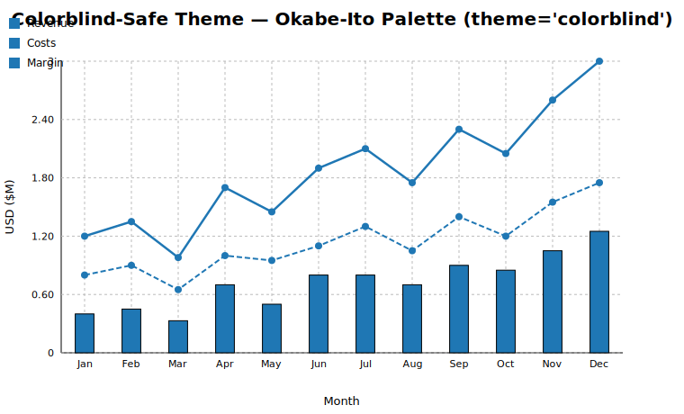

.. code-block:: python

   Figure(theme="colorblind")   # Okabe-Ito palette

Line Styles
~~~~~~~~~~~

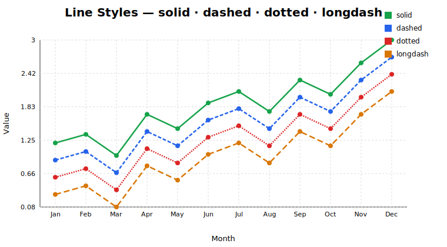

.. code-block:: python

   LineSeries(x, y, linestyle="solid")
   LineSeries(x, y, linestyle="dashed")
   LineSeries(x, y, linestyle="dotted")
   LineSeries(x, y, linestyle="longdash")

Colormap Encoding
~~~~~~~~~~~~~~~~~

.. image:: examples/colormaps.svg
   :alt: Plasma colormap scatter encoding
   :width: 760px
   :align: center

Layout
------

2×2 Subplot Grid
~~~~~~~~~~~~~~~~

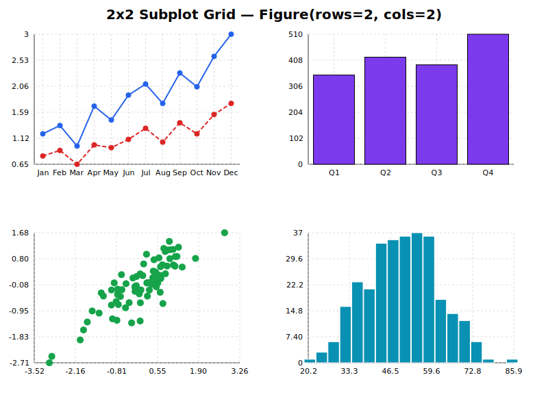

.. code-block:: python

   fig = Figure(rows=2, cols=2, width=800, height=580)
   fig.add_axes(0,0).add_series(LineSeries(...))
   fig.add_axes(0,1).add_series(BarSeries(...))
   fig.add_axes(1,0).add_series(ScatterSeries(...))
   fig.add_axes(1,1).add_series(HistogramSeries(...))

Dual Y-Axis
~~~~~~~~~~~

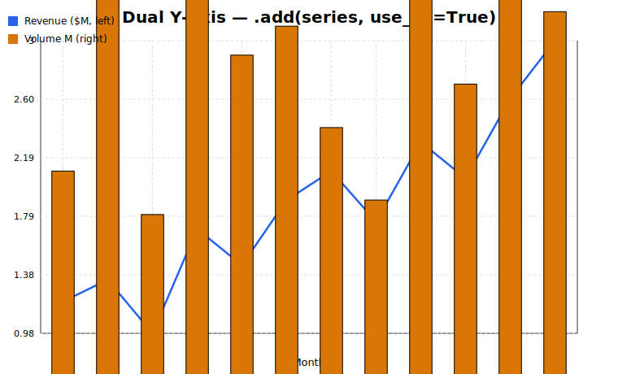

.. code-block:: python

   fig.add(LineSeries(x, prices, label="Price (left)"))
   fig.add(BarSeries(x, volume, label="Volume (right)"), use_y2=True)

DataFrame Accessor
------------------

.. image:: examples/pandas_example.svg
   :alt: Bar chart from DataFrame accessor
   :width: 760px
   :align: center

.. code-block:: python

   import glyphx  # registers df.glyphx

   # Basic
   df.glyphx.bar(x="month", y="revenue", title="Monthly Revenue")
   df.glyphx.bar(groupby="region", y="revenue", agg="sum")

   # Hue splitting — one series per region, auto-colored
   df.glyphx.bar(x="month", y="revenue", hue="region",
                 title="Revenue by Month and Region")

Statistical Charts
------------------

ECDF
~~~~

.. image:: examples/ecdf.svg
   :alt: ECDF comparing control and treatment
   :width: 760px
   :align: center

.. code-block:: python

   from glyphx.ecdf import ECDFSeries

   fig = (
       Figure()
       .add(ECDFSeries(ctrl.tolist(),  color="#3b82f6", label="Control"))
       .add(ECDFSeries(treat.tolist(), color="#ef4444", label="Treatment"))
   )

Raincloud Plot
~~~~~~~~~~~~~~

.. image:: examples/raincloud.svg
   :alt: Raincloud jitter + violin + box
   :width: 760px
   :align: center

.. code-block:: python

   from glyphx.raincloud import RaincloudSeries

   fig.add(RaincloudSeries(groups, categories=["Control","Low","High"], seed=42))

Significance Brackets
~~~~~~~~~~~~~~~~~~~~~

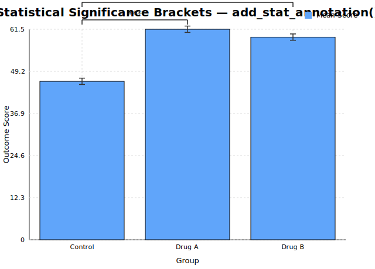

.. code-block:: python

   fig.add_stat_annotation("Control", "Drug A", p_value=0.0002)
   fig.add_stat_annotation("Control", "Drug B", p_value=0.028, y_offset=32)

Financial Charts
----------------

Candlestick OHLC
~~~~~~~~~~~~~~~~

.. image:: examples/candlestick.svg
   :alt: Candlestick OHLC chart
   :width: 700px
   :align: center

Waterfall Bridge Chart
~~~~~~~~~~~~~~~~~~~~~~~

.. image:: examples/waterfall.svg
   :alt: Waterfall revenue bridge
   :width: 720px
   :align: center

Treemap
~~~~~~~

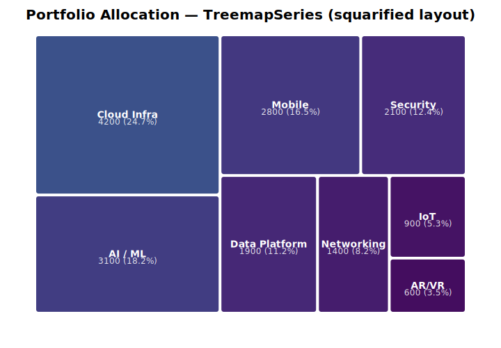

Streaming Data
--------------

.. image:: examples/streaming.svg
   :alt: Live streaming sensor data
   :width: 760px
   :align: center

.. code-block:: python

   from glyphx.streaming import StreamingSeries

   stream = StreamingSeries(max_points=120, color="#2563eb", label="Sensor A")
   fig.add(stream)

   with stream.live(fig, fps=10) as s:
       for reading in sensor_generator():
           s.push(reading)

Downsampling Examples
---------------------

See also :doc:`downsampling` for the complete downsampling API reference.

Two-stage line pipeline (M4 + LTTB)
~~~~~~~~~~~~~~~~~~~~~~~~~~~~~~~~~~~~~

.. code-block:: python

   from glyphx.downsample import maybe_downsample_line
   import numpy as np

   x = np.linspace(0, 1, 2_000_000)
   y = np.sin(x * 500) + np.random.normal(0, 0.1, len(x))

   x_down, y_down = maybe_downsample_line(x, y, pixel_width=800)
   print(f"{len(x):,} → {len(x_down):,} points")

Per-series threshold override
~~~~~~~~~~~~~~~~~~~~~~~~~~~~~~~~

.. code-block:: python

   from glyphx import Figure
   from glyphx.series import LineSeries

   x = list(range(100_000))
   y = [i**0.5 for i in x]

   # Keep at most 500 points for this series
   fig = Figure()
   fig.add(LineSeries(x, y, label="sqrt(x)", threshold=500))
   fig.show()

Inspect downsampling metadata
~~~~~~~~~~~~~~~~~~~~~~~~~~~~~~~~~

.. code-block:: python

   from glyphx import Figure
   from glyphx.series import ScatterSeries
   import numpy as np

   rng = np.random.default_rng(0)
   n = 50_000
   sc = ScatterSeries(rng.uniform(0,1,n).tolist(),
                      rng.uniform(0,1,n).tolist())
   Figure().add(sc).render_svg()

   info = sc.last_downsample_info
   print(f"Algorithm : {info['algorithm']}")
   print(f"Original  : {info['original_n']:,}")
   print(f"Thinned   : {info['thinned_n']:,}")

Gantt / Timeline Chart
-----------------------

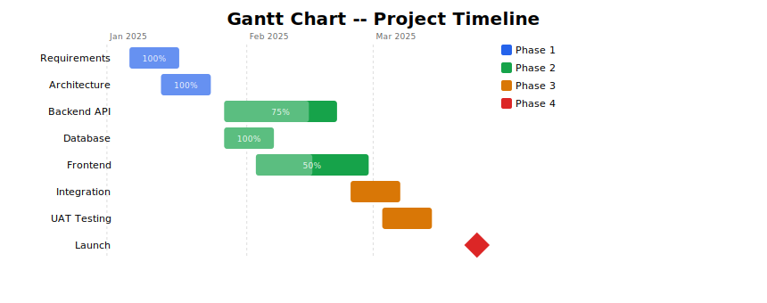

.. code-block:: python

   from glyphx import Figure
   from glyphx.gantt import GanttSeries
   from datetime import date

   tasks = [
       {"task": "Design",   "start": date(2025,1,6),  "end": date(2025,1,17), "group": "Phase 1"},
       {"task": "Backend",  "start": date(2025,1,20), "end": date(2025,2,14), "group": "Phase 2"},
       {"task": "Frontend", "start": date(2025,1,27), "end": date(2025,2,21), "group": "Phase 2"},
       {"task": "Launch",   "start": date(2025,3,3),  "end": date(2025,3,3),  "group": "Phase 3",
        "milestone": True},
   ]

   fig = Figure(width=860, height=360)
   fig.gantt(tasks, group_colors={"Phase 1": "#2563eb",
                                   "Phase 2": "#16a34a",
                                   "Phase 3": "#dc2626"})
   fig.show()

   # Progress bars and tooltips
   tasks[0]["progress"] = 0.75   # 75% complete
   tasks[0]["tooltip"]  = "Design: 3 of 4 tasks done"

Stacked Bar Chart
------------------

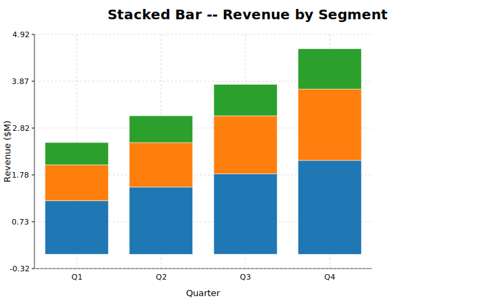

.. code-block:: python

   from glyphx import Figure

   fig = Figure()
   fig.stacked_bar(
       x=["Q1", "Q2", "Q3", "Q4"],
       series={
           "Cloud":  [1.2, 1.5, 1.8, 2.1],
           "AI/ML":  [0.8, 1.0, 1.3, 1.6],
           "Mobile": [0.5, 0.6, 0.7, 0.9],
       },
   )
   fig.show()

   # 100% normalized stacked
   fig.stacked_bar(x=["Q1","Q2","Q3","Q4"], series=revenue_by_segment,
                   normalize=True)

Bump Chart
-----------

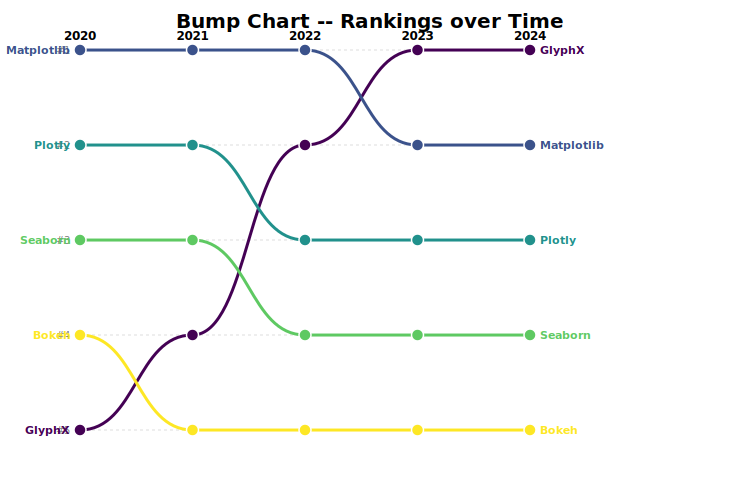

Rank-over-time visualization — no native equivalent in Matplotlib, Seaborn, or Plotly:

.. code-block:: python

   from glyphx import Figure

   fig = Figure(width=820, height=520)
   fig.bump(
       x=["2020", "2021", "2022", "2023", "2024"],
       rankings={
           "GlyphX":     [5, 4, 2, 1, 1],
           "Matplotlib": [1, 1, 1, 2, 2],
           "Plotly":     [2, 2, 3, 3, 3],
           "Seaborn":    [3, 3, 4, 4, 4],
       },
   )
   fig.show()

Sparklines
-----------

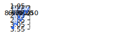

Tiny inline charts for dashboards and KPI tables:

.. code-block:: python

   from glyphx.sparkline import sparkline_svg

   # Returns a raw SVG string — embed directly in HTML tables
   svg = sparkline_svg([1.2, 1.8, 1.5, 2.3, 2.7, 3.1], width=80, height=28)

   # Bar variant
   svg = sparkline_svg(data, kind="bar", color="#dc2626")

   # As a Figure series
   from glyphx import Figure
   from glyphx.sparkline import SparklineSeries
   fig = Figure(width=120, height=40)
   fig.sparkline([1, 3, 2, 5, 4, 6])

AI Chart Recommendation
------------------------

:func:`glyphx.suggest` inspects a DataFrame and returns ranked chart recommendations
with mini preview figures — no external dependencies required:

.. code-block:: python

   from glyphx import suggest
   import pandas as pd

   df = pd.read_csv("sales.csv")
   recs = suggest(df, top_n=5)

   for rec in recs:
       print(f"{rec.kind:12s}  score={rec.score:.0f}")
       print(f"  {rec.reason}")
       rec.preview.show()   # 340×220 mini figure

   # Access recommendation metadata
   best = recs[0]
   print(best.kind, best.x_col, best.y_col, best.hue_col)

Responsive Dark-Mode SVG
--------------------------



:meth:`Figure.render_responsive` outputs an SVG that changes colour automatically
when the operating system switches dark mode — no Python re-render needed:

.. code-block:: python

   from glyphx import Figure
   from glyphx.series import LineSeries
   from pathlib import Path

   fig = Figure()
   fig.add(LineSeries(months, revenue, label="Revenue"))

   # Embed CSS custom properties; browser swaps them on OS dark mode
   svg = fig.render_responsive(dark_theme="dark")
   Path("chart_responsive.svg").write_text(svg)
   # Open in any modern browser — colours follow prefers-color-scheme

Hierarchically Clustered Heatmap (Clustermap)
----------------------------------------------

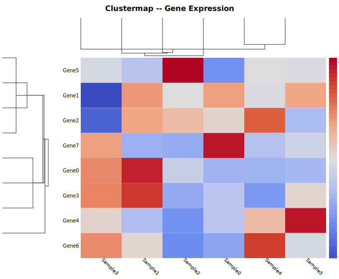

Seaborn's most distinctive bioinformatics chart, now in pure NumPy — no scipy required:

.. code-block:: python

   import pandas as pd
   from glyphx.clustermap import clustermap

   df = pd.read_csv("gene_expression.csv", index_col=0)

   # Basic clustermap with dendrograms on both axes
   fig = clustermap(df, cmap="viridis", row_cluster=True, col_cluster=True,
                    title="Gene Expression Heatmap")
   fig.show()

   # Z-score normalised rows (standard in bioinformatics)
   fig = clustermap(df, z_score="row", cmap="coolwarm",
                    title="Z-scored Gene Expression")
   fig.show()

Hue on Statistical Charts
--------------------------

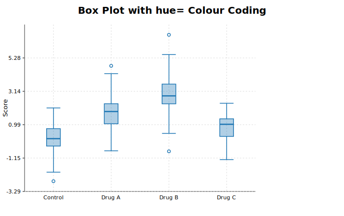

All statistical chart types now accept ``hue=`` and ``hue_colors=``:

.. code-block:: python

   from glyphx import Figure
   from glyphx.series import BoxPlotSeries, HistogramSeries
   from glyphx.violin_plot import ViolinPlotSeries
   import numpy as np

   # Box plot with hue
   data = [control_scores, drug_a_scores, drug_b_scores]
   fig = Figure()
   fig.add(BoxPlotSeries(data, categories=["Control","Drug A","Drug B"],
                         hue=["Placebo","Treatment","Treatment"],
                         hue_colors=["#2563eb","#dc2626"]))
   fig.show()

   # Overlapping histograms by group
   fig = Figure()
   fig.add(HistogramSeries(all_scores, bins=20,
                           hue=group_labels,   # list same length as all_scores
                           alpha=0.55))
   fig.show()

   # Colour-coded violins
   fig = Figure()
   fig.add(ViolinPlotSeries(datasets, hue=["Male","Female","Male","Female"],
                             cmap="viridis"))
   fig.show()

Vega-Lite JSON Export
----------------------

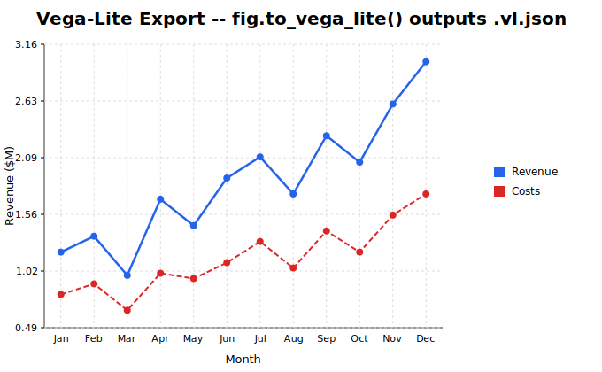

Export any GlyphX figure to a Vega-Lite v5 specification — the first Python
plotting library to produce Vega-Lite output:

.. code-block:: python

   from glyphx import Figure
   from glyphx.series import LineSeries
   from glyphx.vega_lite import to_vega_lite, save_vega_lite

   fig = (Figure()
          .set_title("Monthly Revenue")
          .add(LineSeries(months, revenue, label="Revenue")))

   # Get the spec as a Python dict
   spec = to_vega_lite(fig)

   # Save as a .vl.json file (open in vega-lite.github.io/editor)
   save_vega_lite(fig, "chart.vl.json")

   # Or use the Figure method directly
   fig.to_vega_lite("chart.vl.json")

   # Render with Altair (if installed)
   import altair as alt
   chart = alt.Chart.from_dict(spec)
   chart.show()

FacetGrid — Small Multiples
-----------------------------

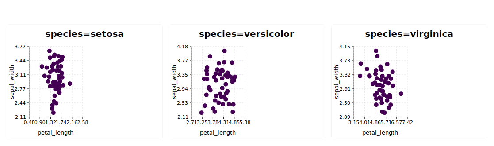

Small-multiples grids with the Seaborn ``.map()`` API:

.. code-block:: python

   import pandas as pd
   from glyphx.facet_grid import FacetGrid

   # Each species gets its own scatter subplot
   g = FacetGrid(penguins_df, col="species", hue="sex",
                 height=300, aspect=1.4)
   g.map("scatter", x="bill_length_mm", y="flipper_length_mm")
   g.show()

   # Histogram per group
   g = FacetGrid(tips_df, col="day", height=250, aspect=1.2)
   g.map("hist", x="total_bill")
   g.show()

   # Wrap into 2 columns
   g = FacetGrid(df, col="category", col_wrap=2, height=280)
   g.map("line", x="date", y="value")
   g.save("facets.svg")

Regression Plot
----------------

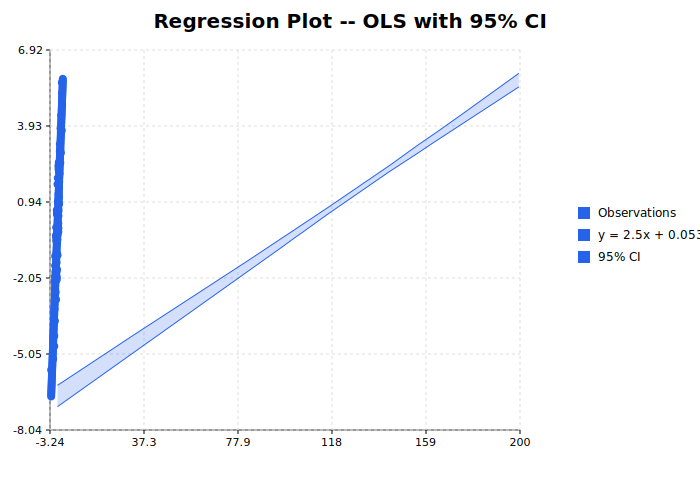

OLS, polynomial, logistic, and LOWESS regression — pure NumPy:

.. code-block:: python

   from glyphx.regplot import regplot

   # Ordinary least squares with CI band
   fig = regplot(df, x="bill_length", y="body_mass")
   fig.show()

   # Polynomial degree-2
   fig = regplot(df, x="age", y="income", order=2, color="#dc2626")

   # LOWESS (no parametric assumption)
   fig = regplot(df, x="gdp_per_cap", y="life_expectancy", lowess=True)

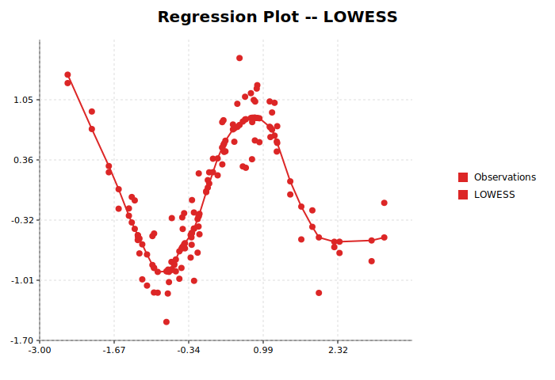

   # Logistic (binary outcome)
   fig = regplot(df, x="dose_mg", y="responded", logistic=True)

   # From raw arrays
   import numpy as np
   x = np.random.randn(200)
   y = 2*x + np.random.randn(200)*0.5
   fig = regplot(None, x_vals=x, y_vals=y, title="Correlation")

Choropleth Map
---------------

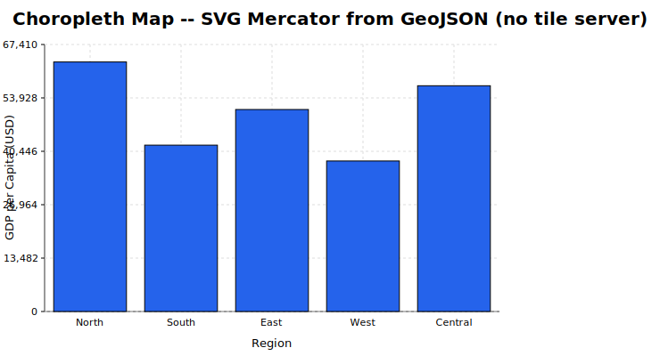

SVG choropleth maps from GeoJSON — no tile server or CDN:

.. code-block:: python

   import json
   from glyphx import Figure
   from glyphx.choropleth import ChoroplethSeries

   geo  = json.load(open("countries.geojson"))
   data = {"USA": 63000, "GBR": 42000, "DEU": 51000, "FRA": 45000}

   fig = Figure(width=900, height=500)
   fig.add(ChoroplethSeries(geo, data,
                             key="iso_a3",          # GeoJSON property name
                             cmap="viridis",
                             missing_color="#e0e0e0"))
   fig.set_title("GDP per Capita (USD)")
   fig.show()

   # Dark theme
   fig = Figure(width=900, height=500, theme="dark")
   fig.choropleth(geo, data, key="iso_a3", cmap="plasma")
   fig.show()

ScatterSeries — Per-Point Size Encoding
-----------------------------------------

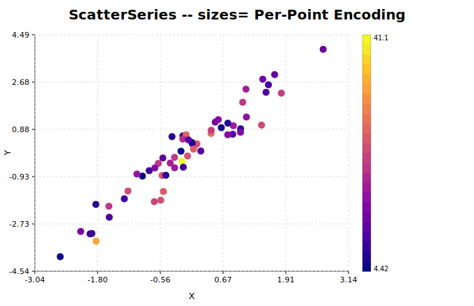

Encode a fourth variable as marker size (Seaborn ``sizes=`` parity):

.. code-block:: python

   from glyphx import Figure
   from glyphx.series import ScatterSeries

   fig = Figure()
   fig.add(ScatterSeries(
       x=gdp_per_cap,
       y=life_expectancy,
       sizes=population,      # per-point marker radius array
       c=continent_code,      # colormap encoding
       cmap="viridis",
       label="Countries",
   ))
   fig.show()
