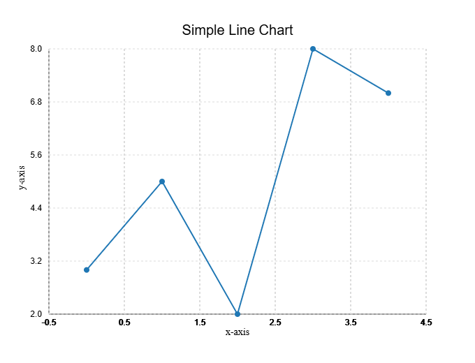

Getting Started
===============

Installation
------------

Install the core library:

.. code-block:: bash

   pip install glyphx

Install optional extras depending on what you need:

.. code-block:: bash

   pip install "glyphx[pptx]"    # PowerPoint export (python-pptx + cairosvg)
   pip install "glyphx[export]"  # PNG / JPG raster export (cairosvg)
   pip install "glyphx[nlp]"     # Natural language charts (anthropic)
   pip install "glyphx[all]"     # Everything

.. note::
   PNG/JPG and PPTX export require the system ``libcairo`` library in addition
   to the Python packages. On macOS: ``brew install cairo``.
   On Ubuntu/Debian: ``sudo apt-get install libcairo2``.

Install from source:

.. code-block:: bash

   git clone https://github.com/kjkoeller/glyphx.git
   cd glyphx
   pip install -e .

Your First Chart
----------------

The quickest path is the ``plot()`` function:

.. code-block:: python

   from glyphx import plot

   plot([1, 2, 3, 4, 5], [3, 5, 2, 8, 7], kind="line", title="Simple Line Chart")

This automatically renders in your Jupyter notebook, opens a browser tab in CLI,
or displays in your IDE's HTML viewer — with no ``.show()`` call required.

The Three APIs
--------------

GlyphX offers three entry points depending on your workflow:

**1. ``plot()`` — one-liner**

Best for quick exploration and scripts:

.. code-block:: python

   from glyphx import plot

   plot(x=["A","B","C"], y=[10, 25, 15], kind="bar", title="Sales by Region")
   plot(data=raw_values, kind="hist", bins=20)
   plot(data=[30, 40, 30], kind="pie", labels=["X","Y","Z"])

**2. Figure + method chaining — full control**

Best for production charts and dashboards:

.. code-block:: python

   from glyphx import Figure
   from glyphx.series import LineSeries, BarSeries

   fig = (
       Figure(width=800, height=500, theme="dark")
       .set_title("Revenue vs Costs")
       .set_xlabel("Month")
       .set_ylabel("USD (thousands)")
       .add(LineSeries(months, revenue, color="#60a5fa", label="Revenue"))
       .add(LineSeries(months, costs, color="#f87171", label="Costs", linestyle="dashed"))
       .set_legend("top-left")
       .tight_layout()
   )

   fig.show()                        # Jupyter / browser
   fig.save("chart.svg")             # SVG file
   fig.save("chart.html")            # Interactive HTML
   fig.share("report.html")          # Self-contained, zero-CDN HTML

**3. DataFrame accessor — pandas-native**

Import ``glyphx`` once and every DataFrame gains a ``.glyphx`` namespace:

.. code-block:: python

   import pandas as pd
   import glyphx  # registers the accessor

   df = pd.read_csv("sales.csv")

   df.glyphx.line(x="date", y="revenue", title="Daily Revenue")
   df.glyphx.bar(x="product", y="units", title="Units by Product")
   df.glyphx.scatter(x="spend", y="conversions")

   # Full chain from the accessor
   (df.glyphx
      .bar(x="month", y="revenue", auto_display=False)
      .set_theme("dark")
      .add_stat_annotation("Jan", "Jun", p_value=0.002)
      .share("monthly_report.html"))

Available Chart Types
---------------------

.. list-table::
   :widths: 30 70
   :header-rows: 1

   * - Kind / Class
     - Description
   * - ``"line"`` / ``LineSeries``
     - Line chart with optional error bars and linestyles
   * - ``"bar"`` / ``BarSeries``
     - Bar chart with optional error bars and groupby
   * - ``"scatter"`` / ``ScatterSeries``
     - Scatter plot with continuous color encoding (``c=``, ``cmap=``)
   * - ``"hist"`` / ``HistogramSeries``
     - Frequency distribution histogram
   * - ``"box"`` / ``BoxPlotSeries``
     - Box-and-whisker; single or multi-group
   * - ``"pie"`` / ``PieSeries``
     - Pie chart with callout labels
   * - ``"donut"`` / ``DonutSeries``
     - Donut chart
   * - ``"heatmap"`` / ``HeatmapSeries``
     - 2-D matrix heatmap with colorbar
   * - ``ECDFSeries``
     - Empirical CDF step function
   * - ``RaincloudSeries``
     - Jitter + half-violin + box combined
   * - ``ViolinPlotSeries``
     - KDE violin plot
   * - ``CandlestickSeries``
     - OHLC financial candles
   * - ``WaterfallSeries``
     - Cumulative bridge / waterfall chart
   * - ``TreemapSeries``
     - Squarified treemap
   * - ``StreamingSeries``
     - Sliding-window real-time chart
   * - ``GroupedBarSeries``
     - Side-by-side grouped bars
   * - ``SwarmPlotSeries``
     - Jittered strip plot
   * - ``CountPlotSeries``
     - Count of categorical values
