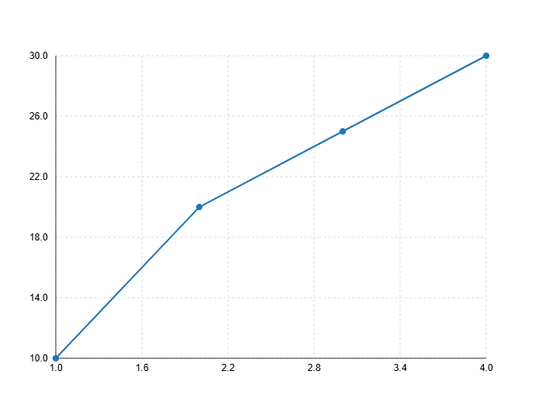

Usage Guide
===========

Basic Plotting
--------------

Use the `plot()` function for quick chart generation:

.. code-block:: python
    
    from glyphx import plot

    plot([1, 2, 3, 4], [5, 7, 3, 9], kind="scatter", color="red")

.. image:: examples/basic_plotting.png
   :alt: Basic Plot
   :width: 680px
   :align: center

Pandas Integration
------------------

You can use DataFrames directly:

.. code-block:: python

    import pandas as pd
    from glyphx import plot

    df = pd.DataFrame({
        "x": [1, 2, 3, 4],
        "y": [10, 20, 25, 30]
    })

    plot(x=df["x"], y=df["y"], kind="line")

Auto Display
------------

No need to call `.show()` — GlyphX will automatically render the chart in:
- Jupyter
- CLI (opens in browser)
- IDE (fallback HTML viewer)

Chart Types
-----------

All chart types support theming, tooltips, and interactivity.
