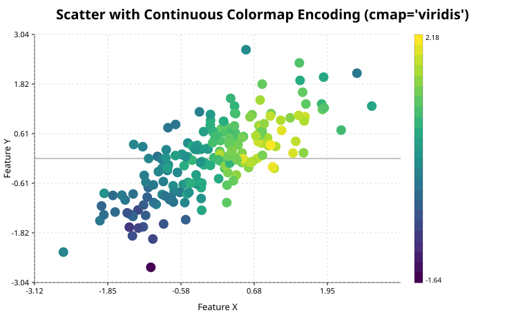
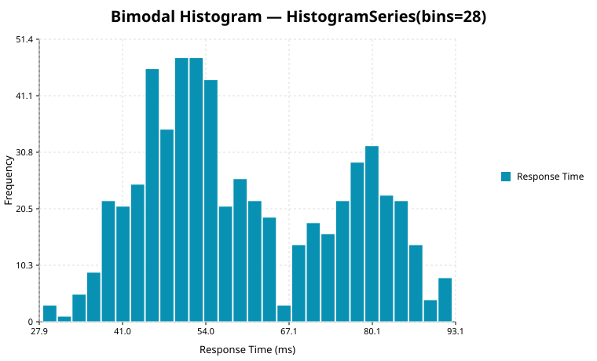
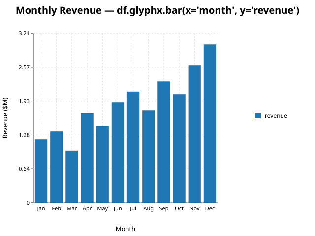
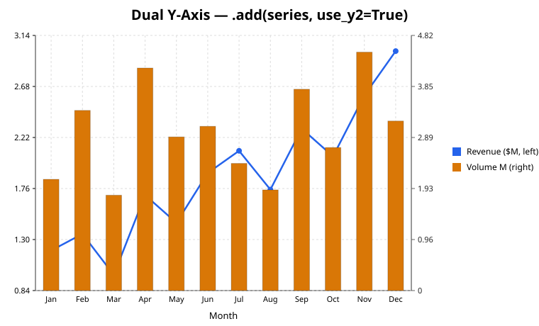

Usage Guide
===========

Basic Plotting
--------------

Use ``plot()`` for the fastest path to any chart type:

.. code-block:: python

   from glyphx import plot

   # Line chart
   plot([1, 2, 3, 4], [5, 7, 3, 9], kind="line",
        color="#2563eb", label="Series A",
        xlabel="X Axis", ylabel="Y Axis", title="Line Chart")

   # Bar chart with categorical X axis
   plot(["Mon","Tue","Wed","Thu","Fri"], [42, 61, 38, 75, 53],
        kind="bar", color="#7c3aed", title="Daily Active Users")

   # Scatter plot with colormap encoding
   plot(x_data, y_data, kind="scatter",
        c=color_values, cmap="viridis", size=7)

   # Histogram from raw data
   import numpy as np
   plot(data=np.random.normal(50, 10, 500), kind="hist", bins=25)

   # Pie chart
   plot(data=[35, 28, 22, 15], kind="pie",
        labels=["Product A","Product B","Product C","Other"])

Method Chaining
---------------

Every mutating ``Figure`` method returns ``self``, enabling full fluent chains:

.. code-block:: python

   from glyphx import Figure
   from glyphx.series import LineSeries, BarSeries

   fig = (
       Figure(width=800, height=500)
       .set_title("Revenue Dashboard")
       .set_theme("dark")
       .set_size(900, 520)
       .set_xlabel("Month")
       .set_ylabel("USD ($M)")
       .set_legend("top-left")
       .add(LineSeries(months, revenue, color="#60a5fa", label="Revenue", width=2.5))
       .add(LineSeries(months, costs, color="#f87171", label="Costs", linestyle="dashed"))
       .annotate("Record High", x=11, y=2.9, arrow=True, color="#fbbf24")
       .tight_layout()
       .share("dashboard.html")
   )

Chainable ``Figure`` methods:

.. list-table::
   :widths: 35 65
   :header-rows: 1

   * - Method
     - Description
   * - ``.add(series, use_y2=False)``
     - Add a series; bind to right Y-axis with ``use_y2=True``
   * - ``.set_title(text)``
     - Set chart title
   * - ``.set_theme(name_or_dict)``
     - Apply a named or custom theme
   * - ``.set_size(width, height)``
     - Resize canvas
   * - ``.set_xlabel(text)``
     - X-axis label
   * - ``.set_ylabel(text)``
     - Y-axis label
   * - ``.set_y2label(text)``
     - Right-hand Y-axis label; no-op without ``use_y2`` series
   * - ``.set_legend(position)``
     - Legend position or ``False`` to hide
   * - ``.set_tick_format(fn)``
     - Tick label formatter, applied to X, Y1 and Y2
   * - ``.set_minor_ticks(n)``
     - Minor tick subdivisions between majors
   * - ``.set_tick_wrap(enabled)``
     - Wrap long X tick labels instead of rotating them
   * - ``.inset_axes(x, y, w, h)``
     - Panel drawn over the plot area with its own scales
   * - ``.annotate(text, x, y, ...)``
     - Add a text annotation with optional arrow
   * - ``.add_stat_annotation(x1, x2, p_value)``
     - Add a significance bracket
   * - ``.tight_layout()``
     - Auto-adjust padding and rotate crowded labels
   * - ``.enable_crosshair()``
     - Synchronized crosshair across all charts on the page
   * - ``.show()``
     - Display (Jupyter or browser)
   * - ``.save(filename)``
     - Save to ``.svg``, ``.html``, ``.png``, ``.jpg``, or ``.pptx``
   * - ``.share(filename, title)``
     - Self-contained, zero-CDN HTML

DataFrame Accessor
------------------

Import ``glyphx`` once and every ``pd.DataFrame`` gains a ``.glyphx`` namespace.
All methods return a ``Figure`` for further chaining:

.. code-block:: python

   import pandas as pd
   import glyphx          # registers the .glyphx accessor

   df = pd.read_csv("sales.csv")

   # Basic charts
   df.glyphx.line(x="date",    y="revenue", title="Daily Revenue")
   df.glyphx.bar( x="product", y="units",   title="Units by Product")
   df.glyphx.scatter(x="spend", y="conversions")
   df.glyphx.hist(col="response_time", bins=20)
   df.glyphx.box(col="score", groupby="treatment_group")
   df.glyphx.pie(labels="category", values="share")
   df.glyphx.heatmap()        # uses all numeric columns

   # Groupby aggregation in one call
   df.glyphx.bar(
       groupby="region",
       y="revenue",
       agg="sum",             # sum | mean | count | max | min
       title="Revenue by Region",
   )

   # Hue splitting — one BarSeries per unique hue value, auto-colored
   # Each group gets its own label (appears in the legend) and a distinct
   # color from the active theme palette.
   df.glyphx.bar(
       x="month",
       y="revenue",
       hue="region",          # splits into North / South series
       title="Revenue by Month and Region",
   )

   # Full chain from the accessor
   (df.glyphx
      .bar(x="month", y="revenue", label="Revenue", auto_display=False)
      .set_theme("colorblind")
      .add_stat_annotation("Jan", "Jun", p_value=0.001)
      .set_xlabel("Month")
      .set_ylabel("Revenue ($M)")
      .share("monthly_report.html"))

.. note::
   When both ``x=`` and ``hue=`` are provided, ``bar()`` produces one
   ``BarSeries`` per unique hue value filtered to its own rows.
   When only ``hue=`` is given (without ``x=``), it aggregates using ``agg=``
   and creates one bar per group.

3-D Charts
----------

Use ``Figure3D`` for interactive Three.js output with an SVG fallback:

.. code-block:: python

   from glyphx import Figure3D, plot3d
   from glyphx.scatter3d import Scatter3DSeries
   from glyphx.surface3d  import Surface3DSeries
   from glyphx.line3d     import Line3DSeries
   from glyphx.bar3d      import Bar3DSeries
   from glyphx.contour    import ContourSeries
   import numpy as np

   # Scatter — continuous color via colormap
   fig = Figure3D(title="Gaussian Clusters", theme="dark",
                  azimuth=45, elevation=30,
                  xlabel="X", ylabel="Y", zlabel="Z")
   fig.add(Scatter3DSeries(xs, ys, zs, c=zs, cmap="plasma",
                           size=4, label="Points"))
   fig.show()      # WebGL interactive viewer
   fig.save("scatter3d.html")

   # Surface — z = f(x, y) over a regular grid
   x = np.linspace(-3, 3, 60)
   y = np.linspace(-3, 3, 60)
   Z = np.sin(np.sqrt(x[None,:]**2 + y[:,None]**2))
   fig = Figure3D(title="Sinc Surface")
   fig.add(Surface3DSeries(x, y, Z, cmap="viridis",
                           wireframe=True, alpha=0.9))
   fig.show()

   # Polyline through 3-D space
   t = np.linspace(0, 4*np.pi, 500)
   fig = Figure3D(title="Helix")
   fig.add(Line3DSeries(np.cos(t), np.sin(t), t / (4*np.pi),
                        color="#dc2626", width=2))
   fig.show()

   # Bar3D
   fig = Figure3D(title="3D Bars")
   fig.add(Bar3DSeries(x_cats, y_cats, heights,
                       color="#2563eb", label="Sales"))
   fig.show()

   # Contour lines / filled contours
   fig = Figure3D(title="Contour")
   fig.add(ContourSeries(x, y, Z, levels=10, filled=True, cmap="coolwarm"))
   fig.show()

   # One-liner 3-D
   plot3d(xs, ys, zs, kind="scatter", title="Quick 3D Scatter")
   plot3d(x, y, Z, kind="surface", title="Quick Surface")

``Figure3D`` constructor parameters:

.. list-table::
   :widths: 25 15 60
   :header-rows: 1

   * - Parameter
     - Default
     - Description
   * - ``width``
     - ``900``
     - Canvas width in pixels
   * - ``height``
     - ``650``
     - Canvas height in pixels
   * - ``title``
     - ``""``
     - Chart title
   * - ``theme``
     - ``"default"``
     - Theme name (same 7 options as 2-D Figure)
   * - ``azimuth``
     - ``45.0``
     - Initial camera azimuth in degrees
   * - ``elevation``
     - ``30.0``
     - Initial camera elevation in degrees
   * - ``xlabel``
     - ``"X"``
     - X-axis label
   * - ``ylabel``
     - ``"Y"``
     - Y-axis label
   * - ``zlabel``
     - ``"Z"``
     - Z-axis label

Column name errors
~~~~~~~~~~~~~~~~~~

An unrecognised column name raises :class:`KeyError` naming the closest match
and listing what is available, rather than being ignored:

.. code-block:: python

   df.glyphx.line(x="Month", y="revenue")
   # KeyError: "Column 'Month' not found. Did you mean 'month'?
   #            Available columns: ['month', 'revenue', 'region']"

This applies to ``x``, ``y``, ``yerr``, ``hue`` and ``groupby``. Omitting
``x`` is still legitimate and falls back to the row index; only a name that
does not exist is an error.

Dual Y-Axis
-----------

Bind any series to the secondary (right-hand) Y-axis with ``use_y2=True``.
The two axes compute independent domains, so a price line and a volume bar
series can share a chart without either being flattened:

.. code-block:: python

   from glyphx import Figure
   from glyphx.series import LineSeries, BarSeries

   fig = Figure(width=800, height=480)
   fig.set_title("Price & Volume")
   fig.add(LineSeries(dates, prices, color="#2563eb", label="Price (left)"))
   fig.add(BarSeries(dates, volume, color="#d97706", label="Volume (right)"),
           use_y2=True)
   fig.set_ylabel("Price ($)").set_y2label("Volume (units)")
   fig.show()

Labelling the right-hand axis
~~~~~~~~~~~~~~~~~~~~~~~~~~~~~

:meth:`~glyphx.Figure.set_y2label` mirrors :meth:`~glyphx.Figure.set_ylabel`,
drawing rotated text down the right edge of the plot area. It is a no-op on a
figure with no ``use_y2`` series, so it is safe to set unconditionally when
building charts from a template.

Gridline alignment
~~~~~~~~~~~~~~~~~~

Right-hand tick rows are derived from the left axis: each Y1 tick's fraction
through its domain is read back out of the Y2 domain. The two sets of
gridlines therefore always coincide, including when
:meth:`~glyphx.layout.Axes.set_yticks` gives the left axis a non-default tick
count.

.. code-block:: python

   fig.axes.set_yticks([10, 20, 30, 40])   # 4 ticks on the left
   # the right axis gets 4 ticks too, on the same pixel rows

Tick formatting
~~~~~~~~~~~~~~~

:meth:`~glyphx.Figure.set_tick_format` applies to all three axes -- X, Y1 and
Y2:

.. code-block:: python

   fig.set_tick_format(lambda v: f"${v:,.0f}")

.. note::

   On a logarithmic Y axis, series that measure from a zero baseline (bar,
   histogram, box plot, waterfall, stacked and grouped bars) are **not**
   zero-anchored, because zero has no position on a log scale. Their domain
   starts at the smallest positive value instead. Non-positive values are
   dropped with a warning, as on any log axis.

Heatmap Colour Ranges
---------------------

``cmap`` accepts any of the named colormaps, the same as every other series
that takes one:

.. code-block:: python

   fig.add(HeatmapSeries(matrix, cmap="coolwarm"))

The range is taken from the data unless it is pinned:

.. code-block:: python

   fig.add(HeatmapSeries(corr, cmap="coolwarm", center=0))
   fig.add(HeatmapSeries(panel_a, cmap="viridis", vmin=0, vmax=100))

.. note::

   ``center`` matters for diverging colormaps such as ``coolwarm`` and
   ``rdbu``, whose whole purpose is a neutral midpoint. Normalising over the
   data's own range puts that midpoint wherever the values happen to
   straddle: on a correlation matrix spanning -0.2 to 1.0, zero lands 17% up
   the ramp and mildly positive correlations render with the colour that
   reads as negative. ``center=0`` widens the narrower side so the neutral
   colour marks zero exactly.

``vmin`` and ``vmax`` pin the range so two panels are comparable; values
outside it clamp to the ends of the ramp.

Aggregation with Confidence Bands
----------------------------------

Repeated measurements -- several y values per x, from several subjects,
trials or runs -- are collapsed into an estimate per x with a bootstrapped
confidence band, without a manual ``groupby`` first:

.. code-block:: python

   fig = Figure(title="Recovery score by treatment arm")
   fig.aggregate_line(df, x="week", y="score", hue="arm")
   fig.set_ylabel("Score (mean, 95% CI)")
   fig.show()

``estimator`` accepts ``"mean"`` (the default), ``"median"``, ``"sum"``,
``"min"``, ``"max"``, ``"count"``, or any callable reducing an array to a
scalar. ``ci`` accepts a confidence level, ``"sd"`` for one standard
deviation, ``"se"`` for standard error, or ``None`` for the line alone.

.. note::

   The bootstrap is seeded, so the same data always produces the same band --
   a figure in a paper should not shift between renders. Pass ``seed=`` to
   change it. A group with only one observation gets no interval rather than
   a fabricated one, since a single value has no spread to resample.

Each band takes its own line's colour, so groups stay readable when ``hue``
splits the data.

For the underlying numbers without a chart, :func:`glyphx.aggregate.aggregate`
returns ``(xs, centre, lower, upper)`` directly.

Math in Labels
--------------

Any label -- title, axis label, legend entry, annotation -- can contain a
``$...$`` span:

.. code-block:: python

   fig.set_ylabel(r"Rate $\frac{dN}{dt}$")
   fig.set_xlabel(r"Inverse temperature $\frac{1}{T}$ (K$^{-1}$)")

Fractions render stacked with a rule over the numerator. Superscripts,
subscripts, Greek letters and the common operators (``\sum``, ``\int``,
``\partial``, ``\nabla``, ``\sqrt``) are supported.

This is a shorthand rather than a full typesetting engine -- there are no
matrices or alignment environments -- and it needs no LaTeX installation.
Screen readers receive the spoken form, so ``$\frac{dN}{dt}$`` is announced
as ``dN/dt`` rather than as markup.

Shared X Axis
-------------

Stacked panels that all plot against one X range -- the usual layout for a
price/volume/indicator stack, or any set of series measured over the same
period:

.. code-block:: python

   fig = Figure(rows=3, cols=1, shared_x=True)
   fig.add_axes(0, 0).add_series(LineSeries(t, price))
   fig.add_axes(1, 0).add_series(LineSeries(t, volume))
   fig.add_axes(2, 0).add_series(LineSeries(t, rsi))

Every cell receives the union of all cells' X domains, so panels line up
vertically even when their series cover different spans. X tick labels are
drawn only on the lowest occupied cell in each column; grid lines and tick
marks stay on all of them, so the alignment remains readable. Sparse grids
work -- if a column's bottom row is empty, the lowest cell that exists keeps
its labels.

Zoom and pan are already synchronised, because a subplot grid renders as a
single ``<svg>`` and the zoom script operates on its ``viewBox``.

Auto Display
------------

GlyphX detects its runtime environment automatically:

- **Jupyter notebook** — renders inline as an SVG cell output
- **CLI / script** — writes a temporary HTML file and opens it in the default browser
- **IDE** — falls back to the browser viewer

To suppress auto-display (e.g. when building charts to export only):

.. code-block:: python

   fig = Figure(auto_display=False)
   fig.save("chart.html")   # explicit save, no auto-open

Export and Sharing
------------------

.. code-block:: python

   fig.save("chart.svg")        # vector SVG
   fig.save("chart.html")       # interactive HTML (zoom, pan, tooltips, export buttons)
   fig.save("chart.pdf")        # vector PDF  — no extra packages needed
   fig.save("chart.png")        # raster PNG  — requires: pip install "glyphx[export]"
   fig.save("chart.jpg")        # raster JPG  — requires: pip install "glyphx[export]"
   fig.save("chart.pptx")       # PowerPoint  — requires: pip install "glyphx[pptx]"

   # Self-contained HTML — zero external dependencies
   html = fig.share()                    # returns HTML string
   fig.share("report.html")             # also writes to disk
   fig.share("report.html", title="Q3") # custom <title> tag

``fig.share()`` inlines all JavaScript into a single file that works in email
clients, Confluence, Notion, GitHub Pages, and offline environments.

PDF is written by a built-in pure-Python writer, so it needs no system
libraries and no browser -- it works in a bare virtualenv or CI container,
which is usually where a camera-ready figure is wanted. The output is true
vector: paths stay paths and text stays selectable, so it scales without
pixelation and can be searched and copied.

Features with no faithful PDF equivalent here -- gradients, clipping paths,
filters -- raise :class:`glyphx.pdf_writer.UnsupportedSVGError` rather than
being dropped, so the file is never quietly missing part of the chart.

pandas Plotting Backend
-----------------------

Existing ``df.plot()`` code becomes GlyphX with one line, and no rewrite:

.. code-block:: python

   import pandas as pd
   pd.options.plotting.backend = "glyphx"

   df.plot(x="month", y="revenue")
   df.plot.bar(x="month", y=["revenue", "costs"])
   df.plot(x="month", y=["revenue", "costs"], subplots=True, sharex=True)

Supports ``line``, ``bar``, ``area``, ``scatter``, ``hist``,
``kde``/``density``, ``box`` and ``pie``, for both ``DataFrame`` and
``Series``, plus ``figsize``, ``title``, ``xlabel``/``ylabel``, ``legend``,
``grid``, ``logx``/``logy``, ``colormap``, ``subplots``, ``sharex`` and
``stacked``. Column resolution matches matplotlib's: omit ``x`` and the index
is used, omit ``y`` and every numeric column is drawn.

.. note::

   Anything unsupported -- ``hexbin``, ``barh``, ``ax=``, ``secondary_y=`` --
   raises ``NotImplementedError`` naming what is missing, rather than
   silently dropping part of the call and returning a chart that looks
   finished.

The return value is a :class:`glyphx.Figure` rather than a matplotlib
``Axes``, so ``.show()``, ``.share()`` and ``.save()`` are available on it.

Log Scale
---------

Pass ``xscale`` or ``yscale`` to the ``Figure`` constructor:

.. code-block:: python

   fig = Figure(yscale="log")
   fig.add(LineSeries(x, y))
   fig.show()

Both axes of a dual-axis chart share the scale setting, so ``yscale="log"``
applies to the secondary axis as well.

Non-positive values are dropped with a warning, since ``log10`` is undefined
at and below zero. Series that measure from a zero baseline -- bar, histogram,
box plot, waterfall, and the stacked and grouped bars -- are not zero-anchored
on a log axis for the same reason; their domain starts at the smallest
positive value in the data.

.. code-block:: python

   fig = Figure(yscale="log")
   fig.add(BarSeries(x, y))     # domain starts at min(y), not 0
   fig.show()

CLI Tool
--------

Plot any CSV, JSON, or Excel file directly from the terminal:

.. code-block:: bash

   glyphx plot sales.csv --x month --y revenue --kind bar -o chart.html
   glyphx plot data.csv --x date --y revenue --kind line --theme dark --open
   glyphx version

Supported input formats: ``.csv`` ``.tsv`` ``.json`` ``.jsonl`` ``.xlsx`` ``.xls``

Supported output formats: ``.svg`` ``.html`` ``.png`` ``.jpg`` ``.pptx``
